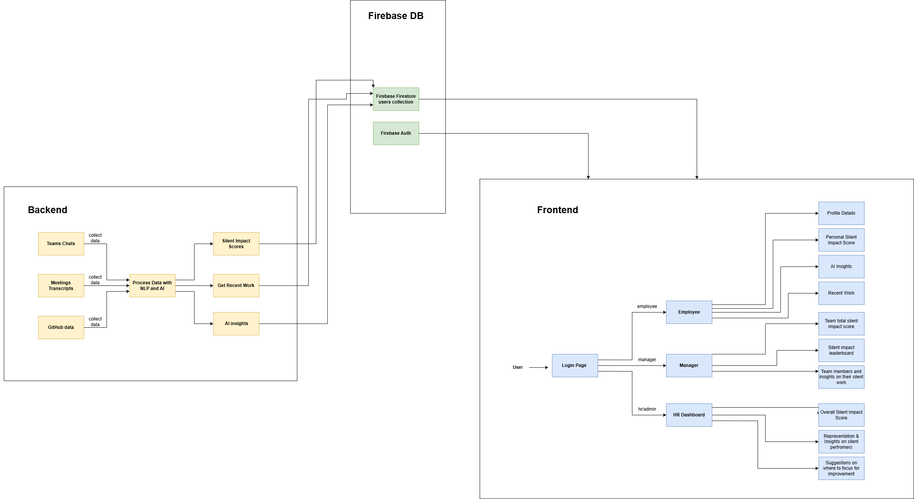
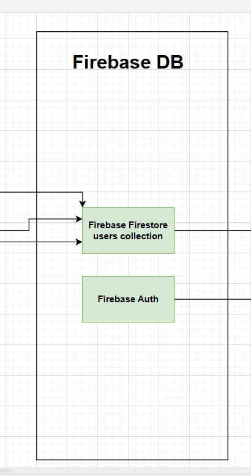

# Gravity
Silent impact tracker that identifies people that hold the team together but aren't given enough credit for it

Gravity is smart system that analyzes and summarizes individual contributions across GitHub, meeting transcripts, and chat data, helping surface impactful, often-overlooked work like support, collaboration, and quiet leadership.

## Demo URL
🔗 **[Check the Vercel Deployment](https://gravity-psi.vercel.app/)**  

## 👤 Demo Login Credentials

| Role     | Email                     | Password     |
|----------|---------------------------|--------------|
| Employee | aishakhan@company.com     | aishakhan    |
| Manager  | daveharley@company.com    | daveharley   |
| HR       | graceadams@company.com    | graceadams   |

## Demo Video
🎥 **[Watch the YouTube demo](https://www.youtube.com/watch?v=DtrJpdPElxA)**  

## What It Does

This tool processes:
- **GitHub PRs** (authorship, reviewers, acknowledgments)
- **Meeting transcripts** (praise, shoutouts, blockers)
- **Teams chat logs** (technical help, appreciation)

And generates:
- 🔢 Weighted impact scores per person  
- 📝 Human-readable summaries of recent work  
- 💡 AI-generated insights (powered by the FaceBook's BART CNN summarization model)

## System Flow

## Screenshots

